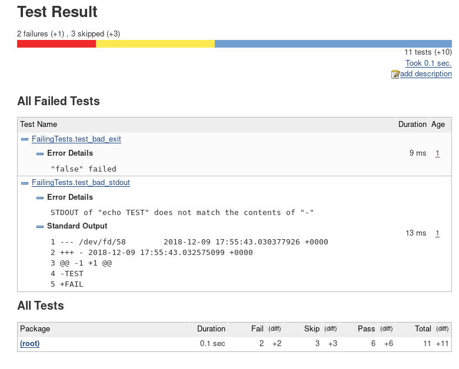

# shelter - Shell-based testing framework


## What is it useful for?

- Writing your system compliance and acceptance tests in pure Bash. An alternative to ServerSpec/Inspec.

  ```bash
  source shelter.sh

  test_service_sshd () {
      assert_success 'systemctl -q is-active sshd'
  }

  test_service_ntpd () {
      assert_success 'systemctl -q is-active ntpd'
  }

  shelter_run_test_class myservices test_service_ | shelter_human_formatter
  ```

- Writing unit-tests for your shell scripts and libraries

  ```bash
  source shelter.sh

  add () {
      bc <<< "$1 + $2"
  }

  test_add_int () {
      assert_stdout 'add 1 2' <<< 3
  }

  test_add_float () {
      assert_stdout 'add 0.9 2.1' <<< '3.0'
  }

  test_add_invalid () {
      assert_fail 'add'
  }

  set -u
  shelter_run_test_class add test_add_ | shelter_human_formatter
  ```


## Highlights

- Machine-readable output
- JUnit XML output format support
- Environment is captured
- STDOUT and STDERR are captured
- Test case, class, suite support
- Multiple command-mocking strategies
- Detailed documentation (`man shelter.sh`, also see the [test suite bolerplate script](cookbook/boilerplate.sh) which you can copy and tailor to your needs)


## Showcase

```bash
source shelter.sh

foo () {
    assert_success true
}

bar () {
    assert_fail false
}

test_good_hello () {
    assert_stdout 'echo Hello' <<< 'Hello'
}

test_good_world () {
    assert_stdout 'echo World' <(echo World)
}

test_bad_stdout () {
    assert_stdout 'echo TEST' <<< 'FAIL'
}

test_bad_exit () {
    assert_success false
}

skip_this_one () {
    assert_success 'echo This test will not be executed'
}

skip_this_one_too () {
    assert_success 'echo Neither this one'
}

test_mock_ls () {
    patch_command function ls 'printf "%s\n%s\n%s\n" file1 file2 file3'

    assert_stdout ls <<EOF
file1
file2
file3
EOF
    unpatch_command ls
}

test_mock_invert_false () {
    patch_command mount /usr/bin/false true

    assert_success 'bash -c "/usr/bin/false"'

    unpatch_command /usr/bin/false

    assert_fail 'bash -c "/usr/bin/false"'
}

test_mock_uname () {
    patch_command path uname 'echo "Microsoft Windows 1.0"'

    assert_stdout uname <<< "Microsoft Windows 1.0"

    unpatch_command uname
}

suite_1 () {
    shelter_run_test_case foo
    shelter_run_test_case bar
    shelter_run_test_class SuccessfulTests test_good_
    shelter_run_test_class FailingTests test_bad_
    shelter_run_test_case skip_this_one
    shelter_run_test_case skip_this_one_too
    shelter_run_test_class MockingTests test_mock_
}

SHELTER_SKIP_TEST_CASES=(skip_this_one skip_this_one_too)

# Mount mocks require root privileges. Skip test_mock_invert_false
# if not run by root
[[ "$(id -u)" -eq 0 ]] || SHELTER_SKIP_TEST_CASES+=(test_mock_invert_false)

shelter_run_test_suite suite_1 | shelter_junit_formatter
```

Output:
```
<?xml version="1.0" encoding="UTF-8"?>
<testsuite name="suite_1" skipped="3" tests="11" time="0.071">
<testcase name="foo" status="0" time="0.010">
</testcase>
<testcase name="bar" status="0" time="0.007">
</testcase>
<testcase classname="SuccessfulTests" name="test_good_hello" status="0" time="0.007">
</testcase>
<testcase classname="SuccessfulTests" name="test_good_world" status="0" time="0.011">
</testcase>
<testcase classname="FailingTests" name="test_bad_exit" status="1" time="0.008">
<failure message="&quot;false&quot; failed" type="assert_success"></failure>
</testcase>
<testcase classname="FailingTests" name="test_bad_stdout" status="1" time="0.009">
<failure message="STDOUT of &quot;echo TEST&quot; does not match the contents of &quot;-&quot;" type="assert_stdout"></failure>
<system-out>
1 --- /dev/fd/58	2018-10-21 18:11:40.551902033 +0100
2 +++ -	2018-10-21 18:11:40.553649148 +0100
3 @@ -1 +1 @@
4 -TEST
5 +FAIL
</system-out>
</testcase>
<testcase name="skip_this_one">
<skipped></skipped>
</testcase>
<testcase name="skip_this_one_too">
<skipped></skipped>
</testcase>
<testcase classname="MockingTests" name="test_mock_invert_false">
<skipped></skipped>
</testcase>
<testcase classname="MockingTests" name="test_mock_ls" status="0" time="0.009">
</testcase>
<testcase classname="MockingTests" name="test_mock_uname" status="0" time="0.010">
</testcase>
</testsuite>
```




Running the same suite piped into `shelter_human_formatter` like this:
```bash
shelter_run_test_suite suite_1 | shelter_human_formatter
```

would output the following:

<pre style="background: #202020; color: #eee">Suite: suite_1 (0.076s)

 [<font color="#72D5A3"><b>+</b></font>] <font color="#FFFFFF"><b>foo</b></font> (0.012s)
 [<font color="#72D5A3"><b>+</b></font>] <font color="#FFFFFF"><b>bar</b></font> (0.011s)
 [<font color="#72D5A3"><b>+</b></font>] <font color="#FFFFFF"><b>SuccessfulTests/test_good_hello</b></font> (0.007s)
 [<font color="#72D5A3"><b>+</b></font>] <font color="#FFFFFF"><b>SuccessfulTests/test_good_world</b></font> (0.008s)
 [<font color="#DCA3A3"><b>F</b></font>] <font color="#FFFFFF"><b>FailingTests/test_bad_exit</b></font> (exit <font color="#DCA3A3"><b>1</b></font>) (0.007s)
     <font color="#DCA3A3"><b>&quot;false&quot; failed</b></font> (assert_success)

 [<font color="#DCA3A3"><b>F</b></font>] <font color="#FFFFFF"><b>FailingTests/test_bad_stdout</b></font> (exit <font color="#DCA3A3"><b>1</b></font>) (0.010s)
     <font color="#DCA3A3"><b>STDOUT of &quot;echo TEST&quot; does not match the contents of &quot;-&quot;</b></font> (assert_stdout)

     captured output:
     ---------------
     <font color="#919191">--- /dev/fd/58</font>	<font color="#919191">2018-10-21 18:12:44.759773788 +0100</font>
     <font color="#919191">+++ -</font>	<font color="#919191">2018-10-21 18:12:44.762143454 +0100</font>
     <font color="#919191">@@ -1 +1 @@</font>
     <font color="#919191">-TEST</font>
     <font color="#919191">+FAIL</font>

 [<font color="#919191"><b>-</b></font>] <font color="#FFFFFF"><b>skip_this_one</b></font>
 [<font color="#919191"><b>-</b></font>] <font color="#FFFFFF"><b>skip_this_one_too</b></font>
 [<font color="#919191"><b>-</b></font>] <font color="#FFFFFF"><b>MockingTests/test_mock_invert_false</b></font>
 [<font color="#72D5A3"><b>+</b></font>] <font color="#FFFFFF"><b>MockingTests/test_mock_ls</b></font> (0.009s)
 [<font color="#72D5A3"><b>+</b></font>] <font color="#FFFFFF"><b>MockingTests/test_mock_uname</b></font> (0.012s)

Test results: 6 passed, 2 failed, 0 errors, 3 skipped
</pre>

Note the `test_mock_invert_false` is skipped if the tests are not run by root.


## Installing

### From source

```bash
sudo make install
```

### Packages for RedHat-based systems

```bash
cat <<"EOF" | sudo tee /etc/yum.repos.d/alikov.repo
[alikov]
name=alikov
baseurl=https://dl.bintray.com/alikov/rpm
gpgcheck=0
repo_gpgcheck=1
gpgkey=https://bintray.com/user/downloadSubjectPublicKey?username=bintray
enabled=1
EOF

sudo yum install shelter
```

### Packages for Debian-based systems

```bash
curl 'https://bintray.com/user/downloadSubjectPublicKey?username=bintray' | sudo apt-key add -

cat <<"EOF" | sudo tee /etc/apt/sources.list.d/alikov.list
deb https://dl.bintray.com/alikov/deb xenial main
EOF

sudo apt-get update && sudo apt-get install shelter
```
